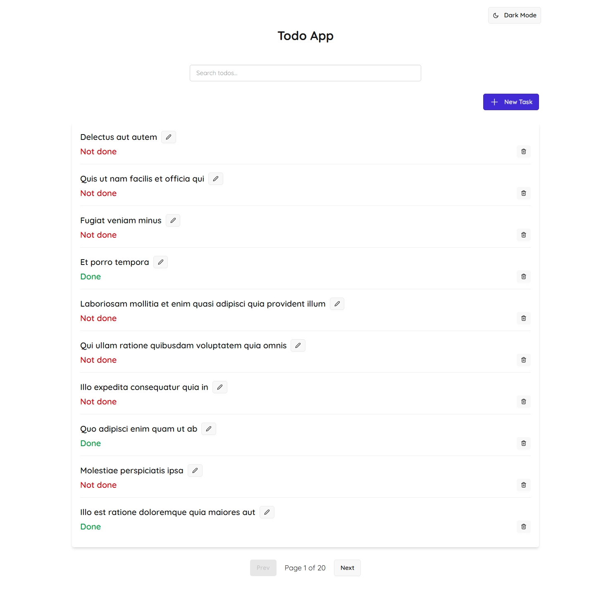
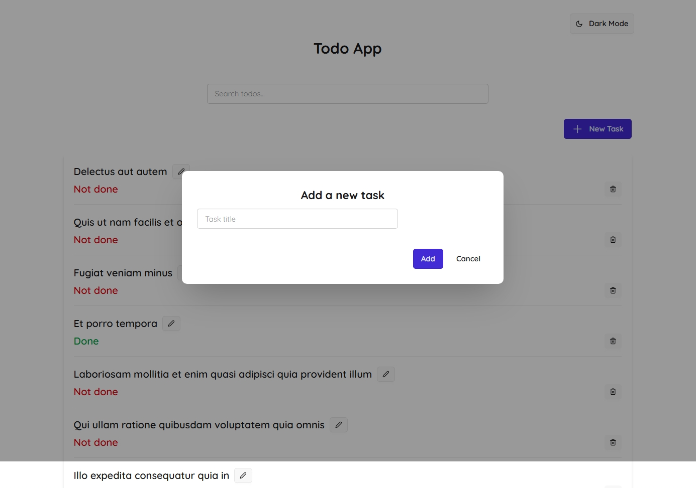
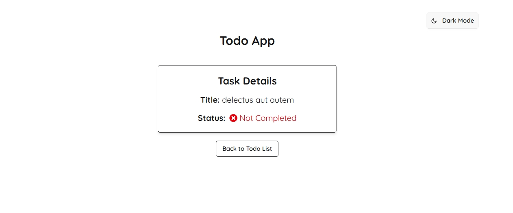
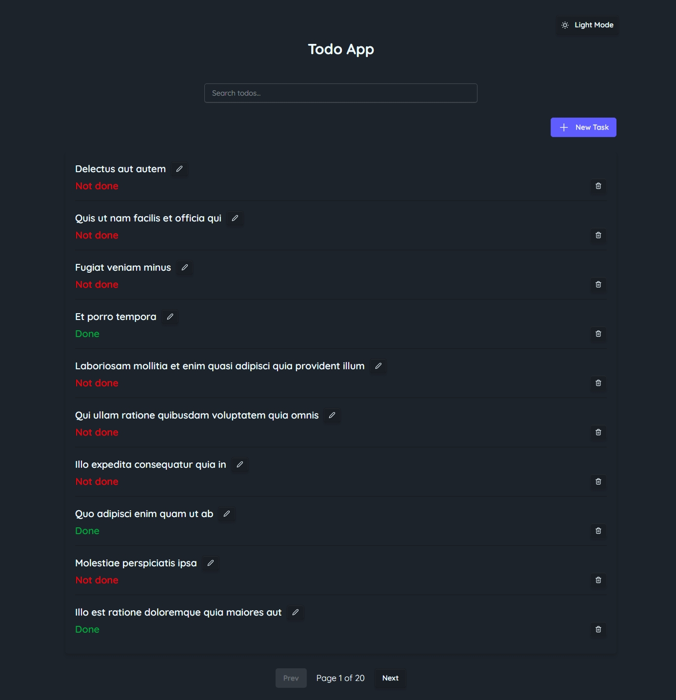

# Todo App – Frontend Examination Project

## Overview

This project is a single-page Todo application developed using React as part of the AltSchool Africa Frontend Engineering Second Semester Examination. It showcases the application of modern frontend development practices, with a focus on usability, accessibility, performance, architectural clarity, **and TypeScript-first correctness**.

### Key Highlights
- Built with **React 19** functional components and hooks
- **TypeScript (TSX/TS)** across the codebase (strict mode + type-only imports)
- Route-level data handling with TanStack Router
- Integrated with REST API endpoints using Axios
- Optimistic UI updates for a seamless user experience
- Utility-first styling via Tailwind CSS and DaisyUI
- Font customization using "Quicksand" via Google Fonts
- SEO enhancements using `@unhead/react`
- Focus management in modals (keyboard navigation, ESC to close, tabIndex control)
- React Icons for visual cues (e.g., plus, trash, edit, status indicators)
- Persistent query cache via localStorage (with Dexie.js as optional offline fallback)
- Accessible and responsive design system with semantic HTML and ARIA roles

> **New:** The app was migrated from **.jsx / .js** to **.tsx / .ts**. See **TypeScript Migration Notes** below.

## Live Demo

- **Deployed App**: https://exam-todo-app-xi.vercel.app/
- **Source Code**: https://github.com/Theezigner/exam-todo-app.git

## Table of Contents

- [Installation](#installation)
- [Scripts](#scripts)
- [Technology Stack](#technology-stack)
- [Architecture](#architecture)
- [TypeScript Migration Notes](#typescript-migration-notes)
- [Features](#features)
- [UI/UX Design](#uiux-design)
- [Accessibility](#accessibility)
- [API Documentation](#api-documentation)
- [Screenshots](#screenshots)
- [Known Issues](#known-issues)
- [Future Improvements](#future-improvements)
- [License](#license)
- [Author](#author)

## Installation

1. Clone the repository:
   ```bash
   git clone https://github.com/Theezigner/exam-todo-app.git
   cd exam-todo-app
   ```

2. Install dependencies:
   ```bash
   pnpm install
   ```

3. Start the development server:
   ```bash
   pnpm run dev
   ```

## Scripts

| Command            | Description                      |
|--------------------|----------------------------------|
| `pnpm run dev`     | Starts local development server  |
| `pnpm run build`   | Builds for production            |
| `pnpm run preview` | Serves the production build      |

## Technology Stack

- **React 19**
- **TypeScript** (TSX/TS, `strict` + `verbatimModuleSyntax`)
- **Vite** (build tool)
- **Tailwind CSS** + **DaisyUI** (component styling)
- **TanStack Router** (nested routing, route loaders, pending & error components)
- **React Query** (data fetching, caching, persistence with fallback)
- **Axios** (API requests)
- **Dexie.js** (IndexedDB support for offline caching)
- **React Hook Form** (form validation)
- **React Icons**
- **React Hot Toast** (notifications)
- **@unhead/react** (SEO support and dynamic metadata)
- **LocalStorage** (query persistence)

## Architecture

```plaintext
src/
├── components/            # Reusable modals, alerts, and buttons
│   ├── createTodoModal.tsx
│   ├── deleteTodoModal.tsx
│   └── editTodoModal.tsx
├── layouts/
│   └── layout.tsx         # App layout with theme toggle and <Outlet />
├── pages/
│   ├── homePage.tsx
│   └── TodoDetailPage.tsx
├── routes/
│   ├── root.route.tsx
│   ├── home.route.tsx
│   └── todoDetail.route.tsx
├── utils/
│   ├── axios.ts
│   ├── dexieDB.ts         # Typed Dexie Table<Todo, ...>
│   └── queryClient.ts
├── screenshots/           # Page images
├── App.tsx                # Root component and provider wrappers
├── main.tsx               # Application bootstrap entry
└── App.css
```

## TypeScript Migration Notes

- **File Extensions:** All React components moved from `.jsx` → `.tsx`; utilities from `.js` → `.ts`.
- **Shared Types:** A canonical `Todo` type lives in `src/utils/dexieDB.ts` and is imported across pages, modals, routes, and loaders to avoid drift.
- **Dexie Typing:** `db.todos` is typed as `Table<Todo, number>` (or `number | string` if needed), removing `any` casts and aligning with loader keys.
- **Router Types:**  
  - `useLoaderData` is used **without** a generic and cast to the loader’s return type (or via `getRouteApi(homeRoute.id)` if preferred).  
  - `errorComponent` uses TanStack’s `ErrorComponentProps`.
- **React Query:** Mutations are typed with `<TData, TError, TVariables>`. Cache updates normalize IDs with `String(id)` to handle number/string differences between online/offline data.
- **Type-Only Imports:** Because `verbatimModuleSyntax` is enabled, types like `Table` are imported with `import type { Table } from "dexie"`.
- **CSS Imports:** For TS to accept `*.css`, a global declaration is included (e.g., `src/vite-env.d.ts` with `declare module "*.css";`).
- **Casing Consistency:** All imports match file casing exactly (Windows is case-insensitive but TypeScript is not).

## Features

- Fetch todos from JSONPlaceholder API
- Paginated and searchable list of todos
- View full task details via nested routes
- Add, edit, and delete todos using modal dialogs
- Optimistic UI for smooth interactions
- Data persistence using React Query + LocalStorage
- Optional offline support with Dexie.js
- SEO metadata via `@unhead/react`
- Responsive and accessible UI
- ARIA support, role-based markup, and semantic HTML

## UI/UX Design

- Layout uses `max-w-md` container for readability
- Consistent spacing and alignment with Tailwind utilities
- Visually distinct button states and focus indicators
- Accessible modals with keyboard interaction support
- Skeleton loaders and toasts improve perceived performance
- Modern and friendly font ("Quicksand") linked via HTML in `index.html`

## Accessibility

- Semantic HTML (`<main>`, `<section>`, `<article>`, etc.)
- `aria-live`, `aria-label`, `aria-modal` used in dynamic components
- Modals support `ESC` to close, `autoFocus`, and `tabIndex`
- Buttons include `aria-label` for clarity
- Color contrast tested for WCAG compliance
- Screen reader-friendly alert and toast messages

## API Documentation

Base API: [`https://jsonplaceholder.typicode.com/todos`](https://jsonplaceholder.typicode.com/todos)

| Method | Endpoint       | Description             |
|--------|----------------|-------------------------|
| GET    | `/todos`       | Retrieve all todos      |
| GET    | `/todos/:id`   | Retrieve single todo    |
| POST   | `/todos`       | Create a new todo       |
| PUT    | `/todos/:id`   | Update existing todo    |
| DELETE | `/todos/:id`   | Delete a todo           |

> **Note**: Since JSONPlaceholder is a mock API, changes are not persisted after a refresh. Local state, React Query, and Dexie.js are used to simulate persistence.

## Screenshots

### Homepage
Displays a paginated list of todos with a search bar.  


### Create Todo Modal
Form to add a new todo with validation and keyboard accessibility.  


### Todo Detail Page
Shows detailed status of a selected task with back navigation.  


### Homepage Dark Mode
Displays a paginated list of todos with a search bar in dark mode.  


## Known Issues

- Created/edited todos may not appear in detail view unless fallback is implemented
- JSONPlaceholder does not support true persistence, affecting realistic syncing
- Dexie.js was set up but full offline mutation sync is not implemented
- SEO improvements are in place, but site performance scoring may vary due to demo API latency
- Modals are accessible but not fully focus-trapped with libraries like `focus-trap-react`
- New learnings had to be done in the process to understand some part of the project

## Future Improvements

- Enable offline sync with background queue (Dexie + mutation sync)
- Replace mock API with real backend (e.g., Supabase or Express server)
- Add authentication and user-specific todos
- Add status filters (completed/incomplete)
- Full test coverage and CI/CD integration
- Add focus-trap to modals for better accessibility
- Ensure edits stays on reload

## License

This project was submitted as part of the AltSchool Africa Frontend Engineering Program. It is intended solely for academic demonstration and evaluation.

## Author

**Temitayo Adebayo**  
AltSchool Africa – Frontend Engineering  
Second Semester, Tinyuka Cohort

